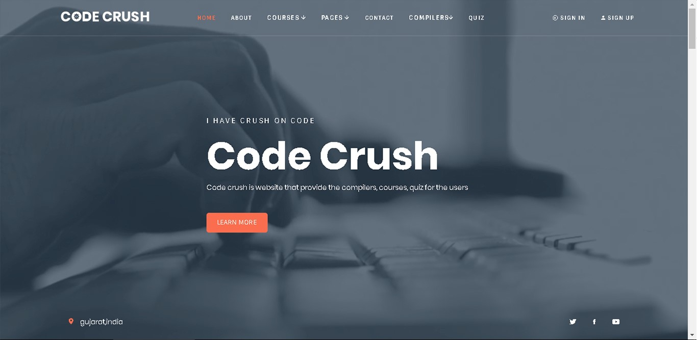
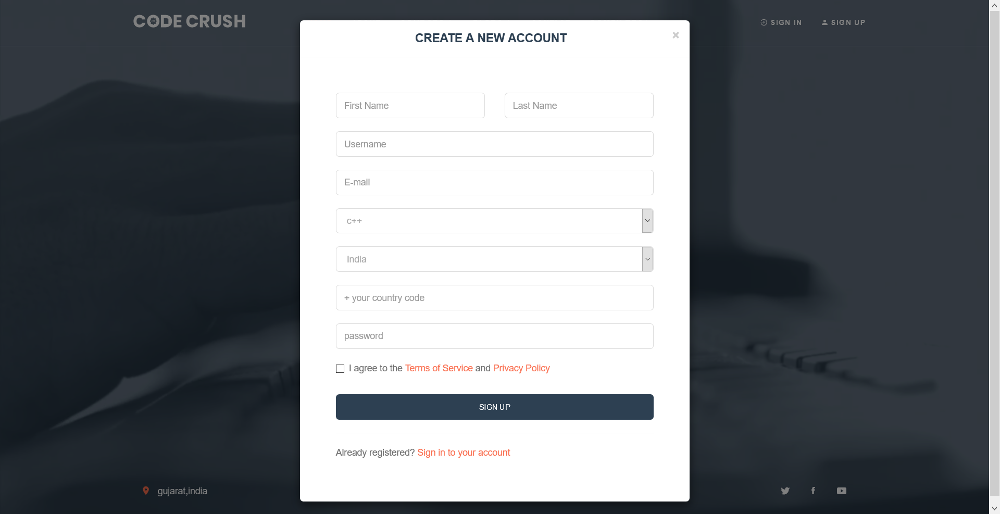
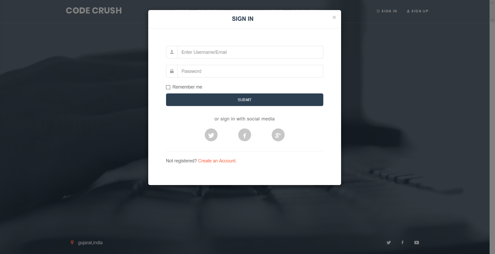
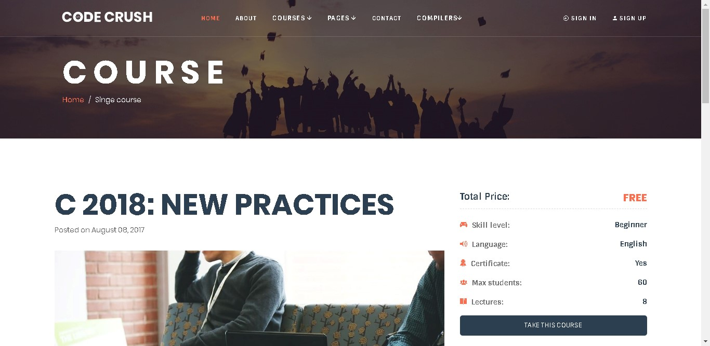
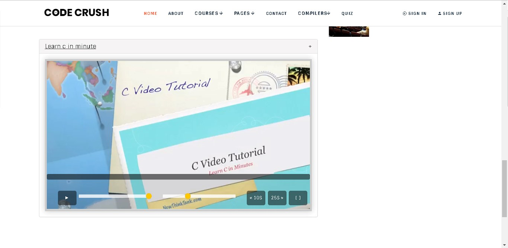
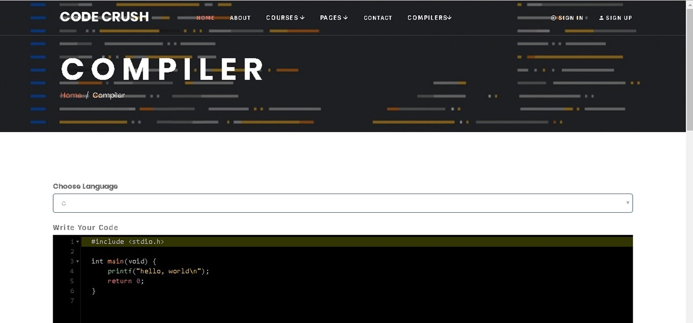
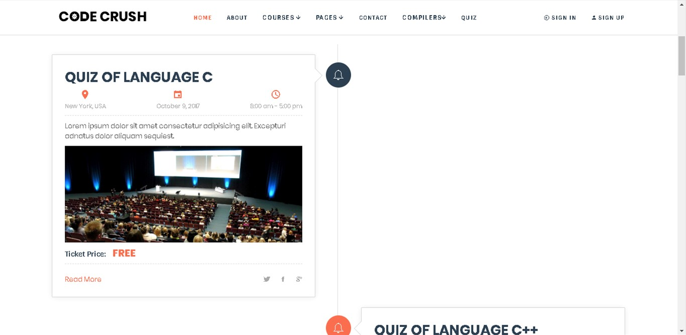
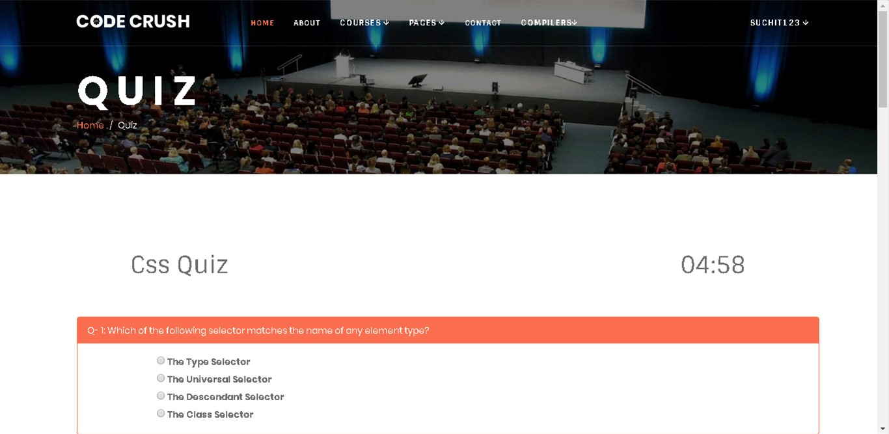
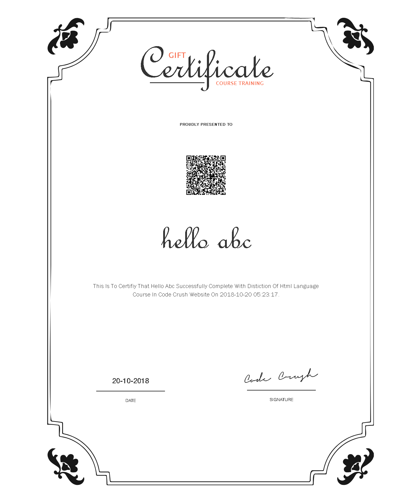

# **Code Crush** 

Coding platform having courses, quizes, coding environment at one place.

## Features 🔥

- E-Learning
- On-demand video courses
- Coding environments
- Quizes

## 📸 Screenshots

|   |   |   |
|---|---|---|
|| 
||
||
|| 
||

## Technology Used 🛠

### Frontend
 
 
 
 
 

### Backend

 
 

